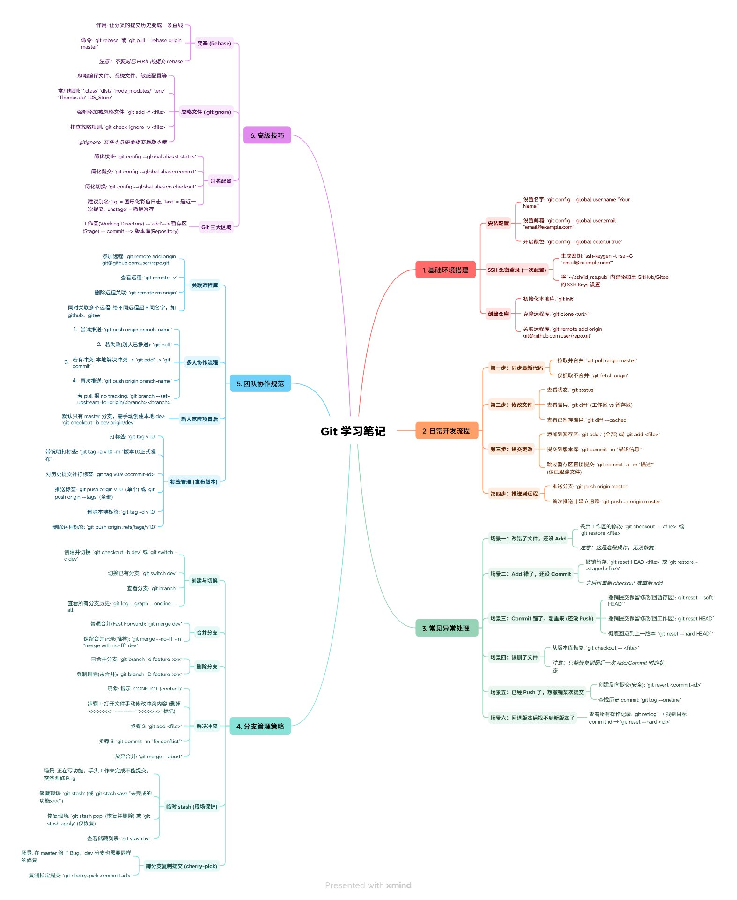

# Git 学习笔记

> Git 版本控制工具系统学习，涵盖从环境搭建到团队协作的完整知识体系。

---

## 思维导图总览

---

## 项目结构

| 文件 | 说明 |
|------|------|
| `git知识点.md` | 文字版 Git 知识点整理 |
| `Git 思维导图.xmind` | XMind 格式思维导图（可编辑） |
| `Git学习笔记.png` | 思维导图预览图片 |

## 知识体系

1. **基础环境搭建** — 安装配置、SSH 密钥、仓库初始化
2. **日常开发流程** — 增删改查、暂存区、版本回退
3. **常见异常处理** — 冲突解决、误删恢复、游离 HEAD
4. **分支管理策略** — 分支创建切换、合并策略、分支模型
5. **团队协作规范** — Pull Request、Code Review、提交规范
6. **高级技巧** — Rebase、Cherry-pick、Stash、标签管理

---

*本仓库用于 Git 课程作业提交与学习记录。*
